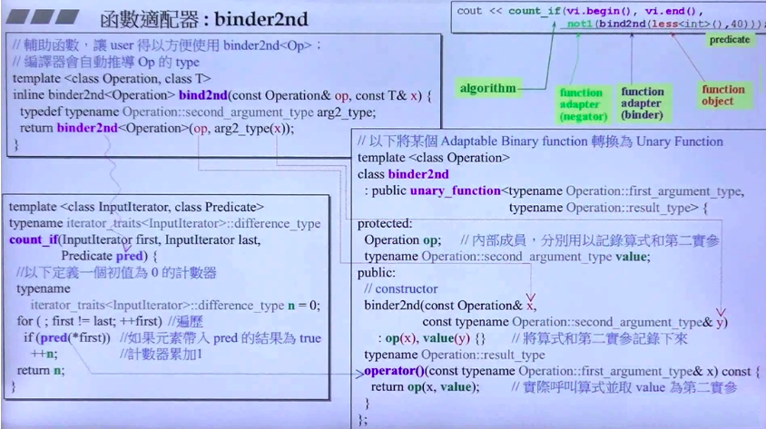
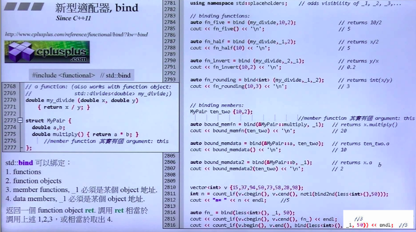
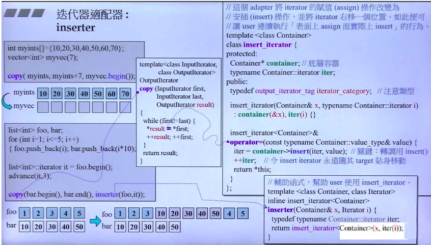
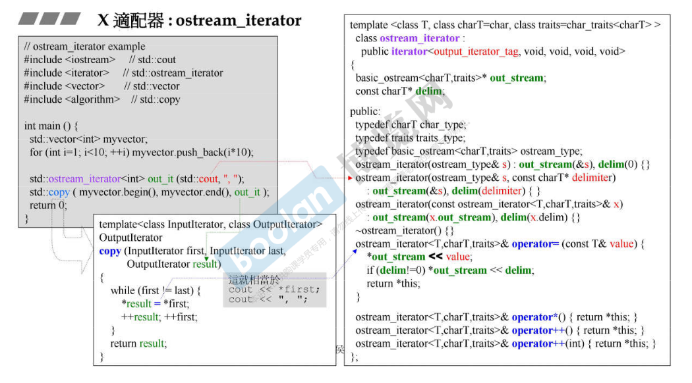
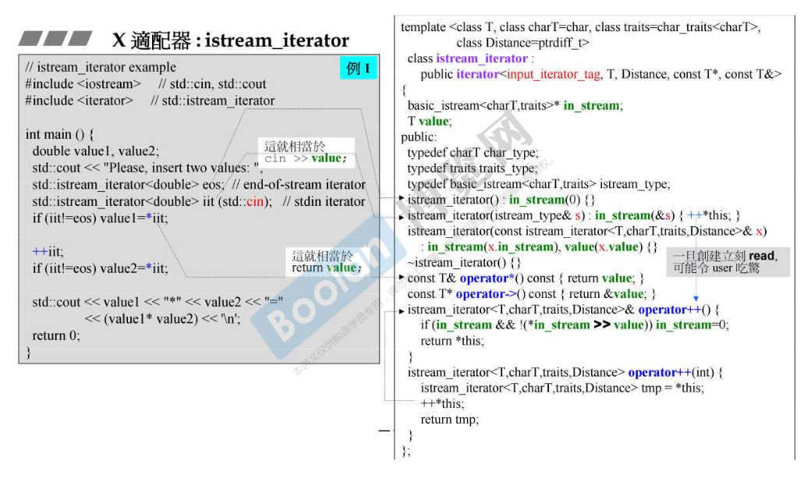

适配器(adapter)

包括 Container、Iterator、Functor 适配器。

适配器：一种用来修饰容器、仿函数或迭代器接口的东西。例如，**STL 提供的 queue 和 stack，虽然看似容器，其实只能算是一种容器适配器，因为它们的底部完全借助 deque，所有操作都由底层的 deque 供应**。改变 functor 接口者，称为 function adapter等。

适配器(adapter) 在 STL 组件的灵活组合运用功能上，扮演者转换器的角色。


### container adapter

STL 提供的两个容器 queue 和 stack，它们修饰 deque 的接口而形成的。

### function adapter

#### binder2nd



使用 Demo

```cpp
count_if(vi.begin(), vi.end(), bind2nd(less<int>(), 40))  << endl;
```

bind2nd 修饰一个函数（less)，也需要之后表示为函数。

首先查看 count_if 的代码，调用到 `__pred(*__first)` 。

```cpp
template <class _InputIter, class _Predicate>
typename iterator_traits<_InputIter>::difference_type
count_if(_InputIter __first, _InputIter __last, _Predicate __pred) {
  __STL_REQUIRES(_InputIter, _InputIterator);
  __STL_UNARY_FUNCTION_CHECK(_Predicate, bool, 
                  typename iterator_traits<_InputIter>::value_type);
  typename iterator_traits<_InputIter>::difference_type __n = 0;
  for ( ; __first != __last; ++__first)
    if (__pred(*__first))
      ++__n;
  return __n;
}
```

调用到的 `__pred(*__first)` 即为 `binder2nd` 中的 ` operator()`

```cpp
template <class _Operation> 
class binder2nd
  : public unary_function<typename _Operation::first_argument_type,
                          typename _Operation::result_type> {
protected:
  _Operation op;
  typename _Operation::second_argument_type value;
public:
  binder2nd(const _Operation& __x,
            const typename _Operation::second_argument_type& __y) 
      : op(__x), value(__y) {}
  typename _Operation::result_type
  operator()(const typename _Operation::first_argument_type& __x) const {
    return op(__x, value); 
  }
};
```

可以发现`binder2nd` 中的 ` operator()`在被调用后，调用 `op` 取到 `first` 和 `value` 进行调用。

```cpp
  operator()(const typename _Operation::first_argument_type& __x) const {
    return op(__x, value); 
  }
```

回到 `bind2nd` 继续推，其实是 `bind2nd`进行`binder2nd`的封装后调用。

```cpp
template <class _Operation, class _Tp>
inline binder2nd<_Operation> 
bind2nd(const _Operation& __fn, const _Tp& __x) 
{
  typedef typename _Operation::second_argument_type _Arg2_type;
  return binder2nd<_Operation>(__fn, _Arg2_type(__x));
}
```

通过在 `bind2nd` 中的 `_Arg2_type(__x)` 转换，来判断 40 是否为 int 类型

> 参照调用时的 `bind2nd(less<int>(), 40))`

而对于 `less` ，`less`继承 `binary_function`

```cpp
  template<typename _Tp>
    struct less : public binary_function<_Tp, _Tp, bool>
    {
      _GLIBCXX14_CONSTEXPR
      bool
      operator()(const _Tp& __x, const _Tp& __y) const
      { return __x < __y; }
    };
```

而 `binary_function`便是之前提到的 `functor`，提供三个参数进行回答。

```cpp
  template<typename _Arg1, typename _Arg2, typename _Result>
    struct binary_function
    {
      /// @c first_argument_type is the type of the first argument
      typedef _Arg1 	first_argument_type; 
      /// @c second_argument_type is the type of the second argument
      typedef _Arg2 	second_argument_type;
      /// @c result_type is the return type
      typedef _Result 	result_type;
    };
```

可以发现 Adapter 中 `typename` 的下面参数正是 functor 中的参数。

```cpp
  typedef typename _Operation::second_argument_type _Arg2_type;
```

再提一嘴 `binder2nd`由于绑定某个函数之后，现在就是函数功能，但是只提供一个参数位置。因此需要继承 `unary_function` 表示一个参数空位。

> 比如此处的 `bind2nd(less<int>(), 40))` 正是绑定 less 之后，留下一个位置给 40.

```cpp
template <class _Operation> 
class binder2nd
  : public unary_function<typename _Operation::first_argument_type,
                          typename _Operation::result_type> {
	...
}
```


#### C11 的 bind



#### 剩余 function adapter

> 用于函数合成：compose1, compose2

> 用于函数指针：ptr_fun

> 用于成员函数指针：mem_fun, mem_fun_ref


### iterator adapter

#### reverse_Iterator

将迭代器的移动行为倒转。以尾到头的方向来处理序列中的元素。

` rbegin() `即传入 `end()`。

```cpp
  // 指向容器尾端的逆迭代器
  reverse_iterator rbegin() 
    { return reverse_iterator(end()); }
```

而 `reverse_iterator` 存在一个 `current `表示正向迭代器。


```cpp
template <class _Iterator>
class reverse_iterator 
{
protected:
  _Iterator current;	// 表示正向迭代器
public:
    // 5 个 types
  typedef typename iterator_traits<_Iterator>::iterator_category iterator_category;
  typedef typename iterator_traits<_Iterator>::value_type value_type;
  typedef typename iterator_traits<_Iterator>::difference_type difference_type;
  typedef typename iterator_traits<_Iterator>::pointer pointer;
  typedef typename iterator_traits<_Iterator>::reference reference;

  typedef _Iterator iterator_type;				// 表示正向迭代器
  typedef reverse_iterator<_Iterator> _Self;	// 表示逆向迭代器

public:
  explicit reverse_iterator(iterator_type __x) : current(__x) {}

  reverse_iterator(const _Self& __x) : current(__x.current) {}
    
  iterator_type base() const { return current; }
    // 此处取值对应的就是正向的-- 也就是退位，即逆向。
  reference operator*() const {_Iterator __tmp = current; return *--__tmp;  }
```


#### 其他 iterator adapter

> insert iterator

插入迭代器内部都维护有一个容器，容器当然有自己的迭代器，当客户端对插入迭代器做赋值操作时，就在插入迭代器中被转为对该容器的迭代器做插入操作。

这个的实现还挺有意思，采用重载 =， 将 从`copy`已经写好的部分都能更改。



`back_insert_iterator`

用于在容器尾部插入的迭代器适配器。

`front_insert_iterator`

用于在容器头部插入的迭代器适配器。

> reverse iterator

将迭代器的移动行为倒转。以尾到头的方向来处理序列中的元素。


### X 适配器

> stream iterator

将迭代器绑定到一个 stream 对象身上，绑定到 istream 对象为 istream_iterator，拥有输入能力。

绑定到 ostream 对象为 ostream_iterator，拥有输出能力。

#### ostream iterator

```cpp
#include <iostream>
#include <iterator>
#include <vector>
#include <algorithm>

int main(int argc, char const *argv[])
{
    std::vector<int> myvector;
    for (int i = 0; i < 10; i++) {
        myvector.push_back(i*10);
    }

    std::ostream_iterator<int> out_it(std::cout, ",");
    std::copy(myvector.begin(), myvector.end(), out_it);
    
    return 0;
}
```

terminal output

```
0,10,20,30,40,50,60,70,80,90,% 
```

通过源码可知：

此处的关键在于重载`operator=`，我们发现 `_M_stream`即为传入的 `std::cout`指针。将 `__value`放在 `cout`，如果 `_M_string`（分隔符号）存在，那么继续放入分隔符。

```cpp
ostream_iterator& operator=(const _Tp& __value) {
	*_M_stream << __value;
	if (_M_string) *_M_stream << _M_string;
	return *this;
}
```




#### istream iterator

```cpp

int main(int argc, char const *argv[])
{
    double value1, value2;
    std::cout << "Please insert two values: ";
    std::istream_iterator<double> eos;		// end of stream
    std::istream_iterator<double> iit(std::cin);	// stdin iterator
    if (iit != eos) {
        value1 = *iit;
    }
    ++iit;
    if (iit != eos) {
        value2 = *iit;
    }

    std::cout << value1 << "*" << value2 << "=" << (value1 * value2) << "\n";
    return 0;
}
```

上面注释的 end of 和 stdin 见下面代码

```cpp
      ///  Construct end of input stream iterator.
      _GLIBCXX_CONSTEXPR istream_iterator()
      : _M_stream(0), _M_value(), _M_ok(false) {}

      ///  Construct start of input stream iterator.
      istream_iterator(istream_type& __s)
      : _M_stream(std::__addressof(__s))
      { _M_read(); }


void _M_read() {	// 和下图的 ++*this 差不多
	_M_ok = (_M_stream && *_M_stream) ? true : false;
	if (_M_ok) {
	    *_M_stream >> _M_value;
	    _M_ok = *_M_stream ? true : false;
	}
 }
```


