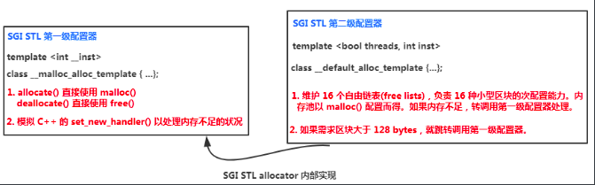
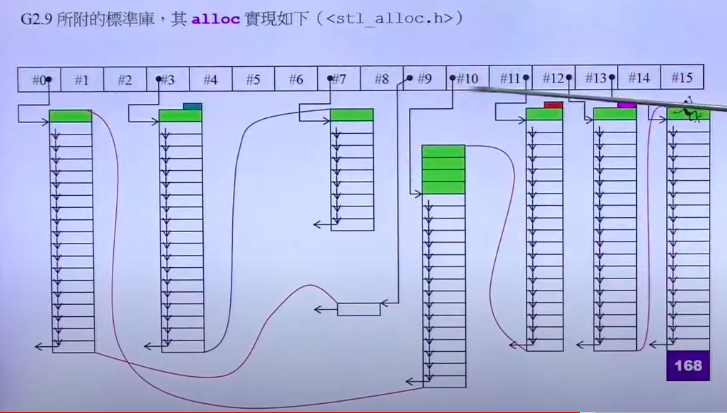

## 调用链路

`defalloc.h` 中的 `allocator` *是原始的 HP default allocator，提供它只是为了回溯兼容。*

```cpp
template <class T>
class allocator {
public:
    typedef T value_type;
    typedef T* pointer;
    typedef size_t size_type;
    typedef ptrdiff_t difference_type;
    pointer allocate(size_type n) { 
	return ::allocate((difference_type)n, (pointer)0);
    }
    void deallocate(pointer p) { ::deallocate(p); }
};

--------
allocator -> allocate -> operator new -> malloc
--------    
    
template <class T>
inline T* allocate(ptrdiff_t size, T*) {
    set_new_handler(0);   // 为了卸载目前的内存分配异常处理函数，强制C++在内存不够的时候抛出std:bad_alloc。
    // 申请size个T类型大小的空间
    T* tmp = (T*)(::operator new((size_t)(size * sizeof(T))));
    if (tmp == 0) {
	cerr << "out of memory" << endl; 
	exit(1);
    }
    return tmp;
}
    
template <class T>
inline void deallocate(T* buffer) {
    ::operator delete(buffer);
}
```

我们发现这个`defalloc.h` 中的 `allocator` 都只是最终调用到 malloc, 而 malloc 会带来 meta ,造成数据的增大.

由注释中的 `// DO NOT USE THIS FILE unless you have an old container implementation that requires an allocator with the HP-style interface. ` 我们去看一下现在在用的 allocator


## 内存管理

### `new` 的调用

```cpp
omplex<int>* p2 = new complex<int>;

--------------
编译器实则做的如下: 先配置内存, 再调用构造函数
--------------
void* mem =  ::operator new(sizeof(pc));	-> malloc
pc = static_cast<complex*>(mem);	
pc->complex::complex(1, 2);	
```

### `delete` 的调用

```cpp
-------------
编译实则做的如下, 先调用析构函数, 再删除内存
-------------
pc->~complex();
operator delete(pc);	->free
```


### array new

```cpp
class A
{
public:
    int id;
    // 必须要有默认函数, 数组初始化调用默认函数
    A() : id(0) {cout << "default A.this=" << this << ", id=" << id << endl; };
    A(int i):id(i) {cout << "construct A.this=" << this << ", id=" << id << endl; };
    ~A()    {cout << "destroy A.this=" << this << endl; };
};


main {
	A* pca = new A[3];    
    delete[] pca;
}
-------------------------------
print  
default A.this=0x55f08e96a088, id=0
default A.this=0x55f08e96a08c, id=0
default A.this=0x55f08e96a090, id=0
destroy A.this=0x55f08e96a090
destroy A.this=0x55f08e96a08c
destroy A.this=0x55f08e96a088
```

可以发现构造与析构方向相反.


当 delete 时, 如果析构函数没有意义(会造成内部布局和析构函数有意义的不一致), 那么 delete 和 delete() 都一样.


### placement new

`placement new` 允许我们将 object 建立在 allocated memory 上.

```cpp
#include <new>
char* buf = new char[sizeof(A) * 3];
A* pc = new(buf)A(1);
...
delete[] buf;

------------
A* pc = new(buf)A(1);
该行被编译器转换成下面的形式
------------
void* mem =  ::operator new(sizeof(pc), buf);	-> 此 buf 就是上面的指针 buf, 和 new 可以进行对比.
pc = static_cast<A*>(mem);	
pc->A::A(1);	  
```

调用函数如下, 返回 ptr, 并不分配内存.

```cpp
void *operator new(__SIZE_TYPE__, void *__ptr) CUDA_NOEXCEPT {
  return __ptr;
}
```

对于重载 new 时, 第一参数必须要是 `size_t`, 多参数才能 placement new

```cpp
    void* operator new(size_t) {};
	------
	比如下面的写法, 才能调用 A* pc = new(buf)A(1); // buf 为指针,
    void* operator new(size_t, void* start) {};
	------
	比如下面的写法, 才能调用 A* pc = new(buf, 1)A(1); // buf 为指针,
    void* operator new(size_t, void* start, int init) {};
```


### 划分整块

一次 malloc 会安排一个 cookie, 包含 metadata.  

因此, 可以换一个思路: 一开始先划分 SIZE * N 大小空间的链表, 然后再进行划分.

具体思路如下面代码

```cpp
#include <cstddef>
#include <iostream>
#include <new>
using namespace std;

class Screen
{
private:
    int i;
    double b;
public:
    Screen(int x) : i(x) {};
    int get() {return i;}
    
    void* operator new(size_t);
    void operator delete(void *p, size_t);

private:
    Screen* next;
    static Screen* freeStore;
    static const int screenChunk;
};

Screen* Screen::freeStore = 0;
const int Screen::screenChunk = 24;

void* Screen::operator new(size_t size) {
    Screen *p;
    if (!freeStore) {
        size_t chunk = screenChunk * size;
        freeStore = p = reinterpret_cast<Screen*>(new char[chunk]);
        // 切片
        for (; p != &freeStore[screenChunk-1]; p++)
        {
            p->next = p + 1;
        }
        p->next = 0;
    }

    p = freeStore;
    freeStore = freeStore->next;
    return p;
}

void Screen::operator delete(void *p, size_t) {
    // cout << "call no global" << endl;
    // 将 delete object 插回 free list 前端
    (static_cast<Screen*>(p))->next = freeStore;
    freeStore = static_cast<Screen*>(p);


}

#include <iostream>
using namespace std;

int main(int argc, char const *argv[])
{
    cout << sizeof(Screen) << endl; // 8

    size_t const N = 100;
    Screen* p[N];

    for (int i = 0; i < N; i++)
    {
        p[i] = new Screen(i);
    }


    cout << "------------locate------------" << endl;
    for (int i = 0; i < 10; i++)
    {
        cout << p[i] << endl;
    }

    cout << "------------delete------------" << endl;
    for (int i = 0; i < N; i++)
    {
        delete p[i];
    }

    return 0;
}
```

### 引入 union

由于 class 初始化的实例, 由于对齐, 会产生多余的空间. 将此空间通过 `union` 使后半段为指针, 节省上一种方法空间.

```cpp
class Airplane
{
private:
    struct AirplaneRep 
    {
        unsigned long miles;
        char type;
    };
    
private:
    union   
    {
        AirplaneRep rep;    // 针对使用中的 obj
        Airplane* next; // 针对 free list 的 obj, 利用位对齐
    };
    

public:
    unsigned long getMiles() {  return rep.miles;   }
    char getType() {    return rep.type;    }
    void set(unsigned long m, char t) {
        rep.miles = m, rep.type = t;
    }

public:
    static void* operator new(size_t size);
    static void operator delete(void* deadObject, size_t size);

private:
    static const int BLOCK_SIZE;
    static Airplane* headOfFreeList;
};

Airplane* Airplane::headOfFreeList;
const int Airplane::BLOCK_SIZE = 512;
```


### static allocator

我们发现, 要是每一个 class 都重写 `operator new` 和 `operator delete` ,实属不 oop. 因此引入 allocator .

```cpp
class Foo
{
public:
    static allocator myAlloc;

public:
    static void* operator new(size_t size) {
        return myAlloc.allocate(size);
    }
    static void operator delete(void* pdead, size_t size) {
        return myAlloc.deallocate(pdead, size);
    }
};
```

通过 static allocator 去调用 allocate, deallocate.


### macro for static allocator

```c
#define DECLARE_POOL_ALLOC()    \
public: \
    void* operator new(size_t size);    \
    void operator delete(void* pdead, size_t size); \
protected:  \
    static allocator myAlloc;

#define IMPLEMENT_POOL_ALLOC(class_name)    \
allocator class_name::myAlloc;
```

放在 class 中实现即为:

```cpp
class GOO
{
DECLARE_POOL_ALLOC()
private:
    ...
public:
    GOO(/* args */);
    ~GOO();
};
IMPLEMENT_POOL_ALLOC(GOO)
```


## GNU 中的设计

* <defalloc.h>----SGI 标准的空间配置器，std::allocator (目前已经弃用)

  allocator 只是基层内存配置/释放行为(::operator::new 和 ::operator::delete)的一层薄薄的包装，并没有考虑到任何效率上的强化。

* SGI 特殊的空间配置器，std::alloc

  SGI STL 的每一个容器都已经指定其缺省的空间配置器为 alloc。


考虑到小型区块可能造成内存碎片问题，SGI 采用两级配置器，第一级配置器直接使用 malloc() 和 free() 实现；第二级配置器使用 memory pool 内存池管理。

第二级配置器的原理：

* 当配置区块超过 128 bytes，就使用第一级配置器
* 当配置区块小于 128 bytes，使用内存池管理



 我们会发现, 也采用上面提到的 union 进行空间的减小.

```cpp
enum {_ALIGN = 8};  // 小型区块的上调边界
enum {_MAX_BYTES = 128}; // 小区区块的上限
enum {_NFREELISTS = 16}; // _MAX_BYTES/_ALIGN  free-list 的个数

// free-list 的节点结构，降低维护链表 list 带来的额外负担
union _Obj {
    union _Obj* _M_free_list_link;  // 利用联合体特点
    char _M_client_data[1];    /* The client sees this. */
};
static _Obj* __STL_VOLATILE _S_free_list[_NFREELISTS];  // 注意，它是数组，每个数组元素包含若干相等的小额区块
```

可发现设计了 16 条链表，每一条负责某一个特定大小的区块，第 0 条负责 8(1×8) 个字节的大小，，第15条负责的每一个区块是128（16×8）字节。
所有的容器要分配内存时，都会找 alloc 要内存，容器元素的大小会被调整为8的倍数，如果 alloc 没有，才会调用 malloc. 每个链表头尾指针带 cookie。


