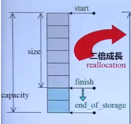
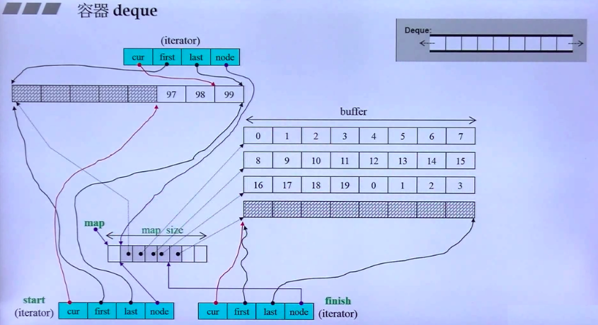

## list

SGI STL 的 list 是一个双向链表，同时还是一个环状的双向链表；对于任何位置的元素插入或元素移除，list 永远是常数时间。

### list 的迭代器

list 的节点可以在存储空间中不连续，所以 list 的迭代器必须具备前移、后移的能力，list 提供是 Bidirectional iterator。

iterator要模拟指针，会有大量的运算符重载。5个typedef.

```cpp
// List 迭代器基类
struct _List_iterator_base {
  typedef size_t                     size_type;
  typedef ptrdiff_t                  difference_type;
  typedef bidirectional_iterator_tag iterator_category;  // 双向移动迭代器

  _List_node_base* _M_node; // 迭代器内部当然要有一个普通指针，指向 list 的节点

  _List_iterator_base(_List_node_base* __x) : _M_node(__x) {}
  _List_iterator_base() {}

  // 比较两个容器操作
  bool operator==(const _List_iterator_base& __x) const {
    return _M_node == __x._M_node;
  }
  bool operator!=(const _List_iterator_base& __x) const {
    return _M_node != __x._M_node;
  }
}; 
```

值得注意的是:

i++ 和 ++i 通过参数有无来区分.

```cpp
  // 迭代器先前进一个节点
  _Self& operator++() { 
      //   void _M_incr() { _M_node = _M_node->_M_next; }  // 前驱
    this->_M_incr();
    return *this;
  }
  // 迭代器后增
  _Self operator++(int) { 
    _Self __tmp = *this;
    this->_M_incr();
    return __tmp;
  }
```

C++中 int ，可以连续两次前加加，但是不能连续两次后加加；list 也是这样，所以 list 后加加操作符重载的返回值是 self ，而不是 self&


且通过 node 节点, 来进行前闭后开的实现.

```cpp
struct _List_iterator_base {
	...
    _List_node_base* _M_node; // 迭代器内部当然要有一个普通指针，指向 list 的节点
    ...
}
  // 指向首元素的迭代器
  iterator begin()             { return (_Node*)(_M_node->_M_next); }
  const_iterator begin() const { return (_Node*)(_M_node->_M_next); }

  // 指向容器尾端的迭代器
  iterator end()             { return _M_node; }
  const_iterator end() const { return _M_node; }
```


## Vector

vector是一种动态增长的数组(每次两倍成长), 且 vector 维护的是一个连续线性空间，所以不论其元素类型为何，普通指针都可以作为 vector 的迭代器而满足所有必要条件。

> array 是静态空间，一旦配置了就不能改变。

靠三个指针start, finish, end_of_storage就可以控制整个容器。容器是前闭后开后开，因此 finish 后面还有空间。

### vector 的数据结构

```cpp
template <class T, class Alloc = alloc>
class vector
{
public:
    typedef T value_type;
    typedef value_type* iterator; // vector 的迭代器是普通指针
protected:
    iterator start;  // 表示目前使用空间的头
    iterator finish; // 表示目前使用空间的尾
    iterator end_of_storage; // 表示目前可用空间的尾
};
```

 

> 一个很有趣的问题：
>
> vector 此处的增长因子是 2 。
>
> 对于采用动态增长的数据结构，可以考虑一下增长因子为 2 以下。原因如下：
>
> https://www.zhihu.com/question/25079705/answer/30030883
>
> 解释：假想有一段连续的内存空间。如果用的倍数是1.2，初始长度是10，那么第一次分配10，地址是0。第二次分配12，地址是10。第三次需要分配15，地址是22。第四次需要分配18，地址可以回到0，因为0到22之间现在都是空闲的。但如果倍数大于等于2，那么 2^n > 2^0 + 2^1 + ... 2^(n-1)） ，永远不会发生地址可以回到0的情况。
>
> > 当然，vector 使用 allocator，而不是 realloc，所以，不管你增长因子是多少，必然需要重新 copy-cons(或move-cons) 一遍；
> > 并且，通用的 C++ 对象不是都可以 memmove 的，虽然绝大部分对象都可以，这也是 allocator 没有 realloc 的原因。


## Deque

因为 deque 是一段段的定量连续空间构成。为了方便管理这些一段段连续空间，同时对用户来说，deque 整体是连续的，所以需要采用一小块连续空间 map 作为**控制单元**，其中 map 中的每个节点 node 都是指针，指向 deque 的一段段连续空间 buffer 缓冲区。

```cpp
template <class _Tp, class _Alloc = alloc, size_t BufSiz = 0>// 此 BufSiz 3.1 版本已经不能再更改了
class deque {
  typedef _Tp value_type;
  typedef _Deque_iterator<_Tp,_Tp&,_Tp*>             iterator;
    
  typedef pointer* _Map_pointer;  
// 以下为 map 的指示
  iterator _M_start;
  iterator _M_finish;
  _Tp** _M_map;
  size_t _M_map_size; 
}
```

会存在一个控制中心带出 buffer , 通过 Iterator 指示此时在 buffer 的位置和边界.



一个小块连续空间 map 包含节点数，最少 8 个，最多是所需节点数加上 2。


### Iterator 的数据结构

```cpp
// deque 迭代器的结构
template <class _Tp, class _Ref, class _Ptr>
struct _Deque_iterator {
  typedef _Deque_iterator<_Tp, _Tp&, _Tp*>             iterator;
  typedef _Deque_iterator<_Tp, const _Tp&, const _Tp*> const_iterator;
  static size_t _S_buffer_size() { return __deque_buf_size(sizeof(_Tp)); }

  typedef random_access_iterator_tag iterator_category;  // Random access iterator
  typedef _Tp value_type;
  typedef _Ptr pointer;
  typedef _Ref reference;
  typedef size_t size_type;
  typedef ptrdiff_t difference_type;
  typedef _Tp** _Map_pointer;

  _Tp* _M_cur;   // 迭代器指向缓冲区的当前元素
  _Tp* _M_first; // 迭代器指向缓冲区的头部
  _Tp* _M_last;  // 迭代器指向缓冲区的尾部
  _Map_pointer _M_node;  // 迭代器指向 map 的 node
}
```

### insert 函数

`insert(pos, x)` 表示允许在 pos 点之前插入 x.

```cpp
  // insert(pos, x)
  iterator insert(iterator position, const value_type& __x) {
    if (position._M_cur == _M_start._M_cur) {// 如果插入的是 deque 的最前端
      push_front(__x);
      return _M_start;
    }
    else if (position._M_cur == _M_finish._M_cur) {// 如果插入的是 deque 的最尾端
      push_back(__x);
      iterator __tmp = _M_finish;
      --__tmp;
      return __tmp;
    }
    else {
      return _M_insert_aux(position, __x);
    }
  }
```

继续调用 `_M_insert_aux` 函数, 会来判断是靠近前端还是后端. 进行推动, 在放到推出的位置上,

```cpp
template <class _Tp, class _Alloc>
typename deque<_Tp, _Alloc>::iterator
deque<_Tp,_Alloc>::_M_insert_aux(iterator __pos, const value_type& __x)
{
  difference_type __index = __pos - _M_start;
  value_type __x_copy = __x;
  if (size_type(__index) < this->size() / 2) {// 判断是靠近前端还是后端
    push_front(front());
    iterator __front1 = _M_start;
    ++__front1;
    iterator __front2 = __front1;
    ++__front2;
    __pos = _M_start + __index;
    iterator __pos1 = __pos;
    ++__pos1;
    copy(__front2, __pos1, __front1);	// 数据搬移
  }
  else {
    push_back(back());
    iterator __back1 = _M_finish;
    --__back1;
    iterator __back2 = __back1;
    --__back2;
    __pos = _M_start + __index;
    copy_backward(__pos, __back2, __back1);	// 数据搬移
  }
  *__pos = __x_copy;
  return __pos;
}
```

### 重载 operator

重载的 ` operator-`

```cpp
// 迭代器 operator-
  difference_type operator-(const _Self& __x) const {
    return difference_type(_S_buffer_size()) * (_M_node - __x._M_node - 1) + (_M_cur - _M_first) + (__x._M_last - __x._M_cur);
  }
```

- `_M_node - __x._M_node - 1`: node 表示 map 中的点. 因此可得到 buffer 的个数
- `_M_cur - _M_first`: 被减数 buffer 中距离其 first 距离, 即元素量
- `__x._M_last - __x._M_cur`: 减数 buffer 中距离其 first 距离, 即元素量

> 特别提一下 `size` 函数
>
> ```cpp
> size_type size() const { return _M_finish - _M_start; } 
> ```

重载的 `operator++`

```cpp

  // 迭代器 前置式operator++
  _Self& operator++() {
    ++_M_cur;  // 先移动下一个元素
    if (_M_cur == _M_last) { // 如果已到达所在缓冲区的尾端
      _M_set_node(_M_node + 1); // 就切换到下一节点(下一个缓冲区)
      _M_cur = _M_first;   // 指向下一个缓冲区的第一个元素
    }
    return *this; 
  }
  
  // 迭代器 后置式operator++
  _Self operator++(int)  {
    _Self __tmp = *this;
    ++*this;// 调用 前置式operator++
    return __tmp;
  }
```


## stack&queue

Sequence默认是deque；queue的内部默认有一个deque，封掉deque的某些功能，就实现了queue。

```cpp
template<class T, class Sequence=deque<T>>

Sequence c;//低层容器
```

stack&queue 不像 vector、list、deque 那样独立实现，它是可以使用某种容器作为底部结构，来实现 stack&queue 的功能，更确却说 stack&queue 是 adapter(配接器)。

SGI STL 里的 stack&queue 使用的是以 deque 为底部结构来实现其所有功能。

同时 list(双向开口) 数据结构，只要关闭首端，也可以作为 stack&queue 的底部结构。

```cpp
stack<int, list<int>> c2;
c2.push(3);
```

> 只要实现 stack or queue 相关函数即可. 比如 vector 支持 stack, 但是不支持 queue.因为 vector 没有 pop_front.

stastack&queueck 都不允许遍历, 因此都没有迭代器。

