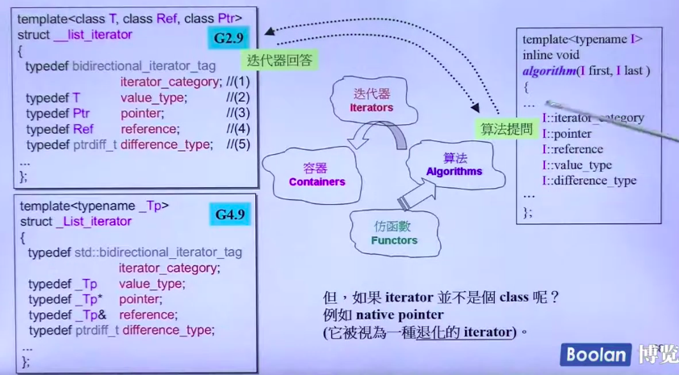
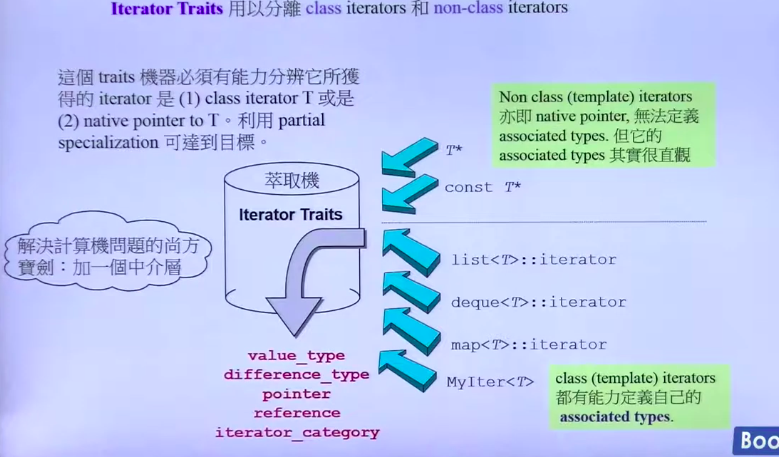

## 迭代器(iterator)

迭代器：扮演容器与算法之间的桥梁，是所谓的 “泛型指针”，共有五种类型，以及其它衍生变化。从实现的角度来看，迭代器是一种将 `operator*`，`operator->`，`operator++`，`operator--` 等指针相关操作予以重载的 class template。 所有 STL 容器都附带有自己专属的迭代器。 native pointer 也是一种迭代器。

```cpp
template<class _Tp, class _Ref, class _Ptr>
struct _List_iterator : public _List_iterator_base {
  typedef _List_iterator<_Tp,_Tp&,_Tp*>             iterator;
  typedef _List_iterator<_Tp,const _Tp&,const _Tp*> const_iterator;
  typedef _List_iterator<_Tp,_Ref,_Ptr>             _Self;

  typedef _Tp value_type;
  typedef _Ptr pointer;
  typedef _Ref reference;
  typedef _List_node<_Tp> _Node;

  _List_iterator(_Node* __x) : _List_iterator_base(__x) {}
  _List_iterator() {}
  _List_iterator(const iterator& __x) : _List_iterator_base(__x._M_node) {}
}
    
    // List 迭代器基类
struct _List_iterator_base {
  typedef size_t                     size_type;
  typedef ptrdiff_t                  difference_type;
  typedef bidirectional_iterator_tag iterator_category;  // 双向移动迭代器
    
   _List_node_base* _M_node; // 迭代器内部当然要有一个普通指针，指向 list 的节点
}
```


## 迭代器(iterator) 是一种 smart pointer

迭代器是一种行为类似指针的对象，而指针的各种行为中最常见的用途是 dereference 和 member access。迭代器最重要的就是对 `operator*` 和 `operator->`进行重载工作。

auto_ptr：用来包装原生指针(native pointer)的对象，在头文件 <memory> 中定义。

为什么每一种 STL 容器都提供有专属迭代器的缘故。

主要是暴露太多细节，所以把迭代器的开发工作交给容器去完成，这样所有实现细节可以得到封装，不被使用者看到。


## 迭代器相应类型(associated types)

> 下面采用的是,  algorithm 直接提问泛化 Iterator



迭代器所指对象的类型。

利用 function template 的参数推导机制，只能推导出参数的类型，无法推导出函数返回值类型。

迭代器相应类型有五种：

> reference, iterator category 从未在 STL 中使用过.

  + value type
  + difference type
  + pointer
  + reference
  + iterator category


## Traits 编程技术

> native pointer 也是一种迭代器。

由于收到的 iterator 可能是退化的指针 (native pointer) . 因此需要加入中间层 traits 进行判断.



traits 意为 “特性”，扮演 “特性萃取机” 角色，萃取各个迭代器的特性(相应类型)。

那么之后调用 `iterator` 时, 便可以如下面代码间接实现调用.

```cpp
template <class I, ...>
void algorithm(...) {
   typename iterator_traits<I>::value_type,
}
```

template partial specialization 模板偏特化：针对 template 参数更进一步的条件限制所设计出来的一个特化版本，本身仍然是 template。

> 下面是泛化的版本.

```cpp
tempalte<typename I>
struct iterator_traits
{
    typedef typename I::iterator_category  iterator_category;
    typedef typename I::value_type  value_type;
    typedef typename I::difference_type  difference_type;
    typedef typename I::pointer  pointer;
    typedef typename I::reference  reference;
};
```

* 迭代器相应类型之一：value type

value type 就是迭代器所指对象的类型。

```cpp
template <class T>
typename iterator_traits<I>::value_type func(I ite)
{
    return *ite;
}
```

* 迭代器相应类型之二：difference type

difference type 用来表示两个迭代器之间的距离。

```cpp
template <class I, class T>
typename iterator_traits<I>::difference_type cout(I first, I last, const T& value)
{
    typename iterator_traits<I>::difference_type n = 0;
    for (; first != last; ++first)
    {
        ++n;
    }
    
    return n;
}
```

* 迭代器相应类型之三：reference type

在 c++ 中，函数如果要传回左值，都是以 by reference 的方式进行，所以如果 p 是一个迭代器，它的 value type 是 T ，那么`*p` 应该是T& (即reference type)


### iterator_category

```cpp
// iterator_category 五种迭代器类型
// 标记
struct input_iterator_tag {};
struct output_iterator_tag {};
struct forward_iterator_tag : public input_iterator_tag {};
struct bidirectional_iterator_tag : public forward_iterator_tag {};
struct random_access_iterator_tag : public bidirectional_iterator_tag {};
```

